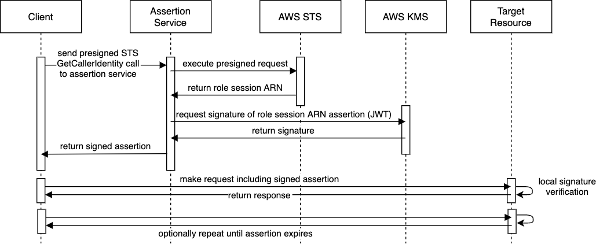

# AWS Assert Role

## Problem

We would like a way to do AWS native, secure service-to-service authentication with credential rotation. Bootstrapping trust from within a system is hard to do without letting administrators access secrets they shouldn't be allowed to. AWS provides [IAM roles](https://docs.aws.amazon.com/IAM/latest/UserGuide/id_roles.html) which solve this problem for access to AWS resources and specific applications integrated with [API Gateway](https://docs.aws.amazon.com/apigateway/latest/developerguide/permissions.html), but we would like to be able to have a similar capability with any application. Unfortunately AWS does not include the role assertions on the signed [instance identity document](https://docs.aws.amazon.com/AWSEC2/latest/UserGuide/instance-identity-documents.html) for EC2 or [task metadata](https://docs.aws.amazon.com/AmazonECS/latest/developerguide/task-metadata-endpoint-v4.html) or [credentials](https://docs.aws.amazon.com/AmazonECS/latest/developerguide/task-iam-roles.html) endpoints for ECS.

## Solution

This idea was inspired by CyberArk DAP [IAM Authenticator integration](https://docs.cyberark.com/Product-Doc/OnlineHelp/AAM-DAP/Latest/en/Content/Operations/Services/AWS_IAM_Authenticator.htm). The client will pre-sign an STS [`GetCallerIdentity`](https://docs.aws.amazon.com/STS/latest/APIReference/API_GetCallerIdentity.html) request, which can then be executed by a trusted entity. Handing over this signature will not compromise the security of the IAM role secret keys. The trusted entity will get a response directly from AWS STS, which can be trusted. We then know the caller has that specific role session. This could be done on every app request, but making a network call every time is slow and susceptible to throttling. We instead sign that assertion with [KMS asymmetric keys](https://aws.amazon.com/blogs/security/digital-signing-asymmetric-keys-aws-kms/). The `RSASSA_PKCS1_V1_5_SHA_256` algorithm supported by KMS is the same one used for `RS256` signed JWTs. By constructing the appropriate JWT header and body, this allows us to issue industry standard tokens which can be verified by client libraries across many languages.

This design prevents administrators from seeing application tokens. The only ways for them to get tokens is to edit the IAM [role trust policy](https://aws.amazon.com/blogs/security/how-to-use-trust-policies-with-iam-roles/) or to get on the host itself and pull role credentials. Both of these would compromise the IAM role system as a whole, so we maintain the same security posture as access to AWS resources. Below is an example of an admin user being denied an assume role request where the trust policy principal is only `ecs-tasks.amazonaws.com`.

> An error occurred (AccessDenied) when calling the AssumeRole operation: User: arn:aws:sts::123456789012:assumed-role/SOURCE_ROLE_NAME/SESSION_NAME is not authorized to perform: sts:AssumeRole on resource: arn:aws:iam::123456789012:role/TARGET_ROLE_NAME

## Sequence Diagram

## STS request signing options

- JavaScript
  - via [internal packages](./presign-get-caller-identity/presign-via-sigv4.js)
  - via [middleware](./presign-get-caller-identity/presign-via-middleware.js) (publicly supported interface)
  - via custom package [aws4](https://www.npmjs.com/package/aws4)
